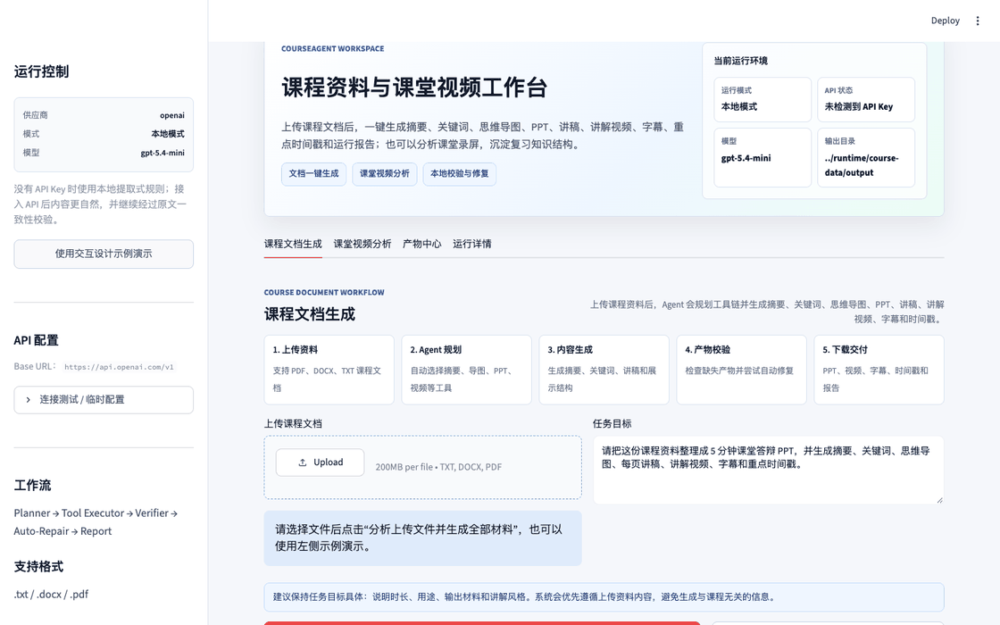
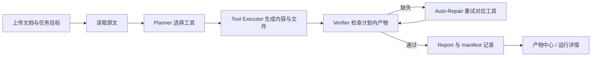

<div align="center">

# 📚 CourseAgent

### 从一份课程资料，到一套能讲、能看、能下载的学习材料

上传课件或课堂录屏，说明你的目标，让 CourseAgent 帮你整理摘要、知识结构、展示材料与复习索引。

[查看演示](#真实界面演示) · [使用方式](#如何使用) · [快速开始](#快速开始) · [生成文件](#产物说明) · [工作原理](#工作原理)

</div>

## 真实界面演示

<p align="center">
  
  <br>
  <sub>内置交互设计示例 → 生成摘要、导图、PPT 与字幕版视频 → 查看历史产物与执行计划</sub>
</p>

这段 GIF 由项目的 **Streamlit 前端实际运行**后，按点击流程截取画面制作。演示使用仓库内置示例和 `MOCK_MODE=true`，内容由本地提取式规则生成，不调用在线大模型；为离线复现关闭了语音合成，因此视频是**字幕版**。

## 为什么用它

课程资料往往散落在 PDF、讲义和录屏里。做一次课堂展示，需要重新梳理重点、安排 PPT 顺序、写讲稿；复习一段录屏，还得自己找关键时间点。CourseAgent 把这些步骤放进同一个工作台，生成结果和执行过程都按批次保存，方便检查、下载和再次展示。

| 场景 | 你要做的事 | CourseAgent 帮你整理 |
| :--- | :--- | :--- |
| **准备课堂答辩** | 上传课程文档，写明展示时长与目标 | 摘要、关键词、思维导图、PPT 大纲、逐页讲稿与可下载 PPT；需要时生成讲解视频 |
| **复习课堂录屏** | 上传视频，可同时提供对应 SRT 字幕 | 课程总结、知识点、导图、重点时间戳与 Highlight 标记 |
| **复用展示成果** | 打开「产物中心」选择历史批次 | 找回文件、筛选记录、固定展示版本，并在「运行详情」检查生成过程 |

生成内容取决于**你的任务目标**；写明“只要摘要和关键词”，就不必跑完整的 PPT 与视频流程。

## 如何使用

1. **先体验示例**：启动工作台后点击「示例一键演示」，不用准备文件，也不用 API Key。演示会用内置的交互设计课程资料跑完整文档流程。
2. **换成自己的资料**：在「课程文档生成」上传 TXT、DOCX 或文本型 PDF，输入具体目标，例如“请整理 5 分钟课堂展示用的摘要、导图和 PPT”，再点击「分析上传文件并生成全部材料」。
3. **查看与交付**：在当前页面预览常用结果，到「产物中心」下载本次文件；如需了解工具选择和校验结果，打开「运行详情」。

想分析录屏：切换到「课堂视频分析」，上传 MP4、MOV 或 MKV，可再上传对应的 `.srt` 字幕，点击「分析课堂视频并生成知识结构」。**优先提供 SRT**，可以跳过本地语音识别模型的首次下载。页面需要视频文件；只有 SRT 时无法从界面启动分析。

### 四个工作区

| 工作区 | 用来做什么 |
| :--- | :--- |
| **课程文档生成** | 上传资料、描述目标、预览本次生成的摘要、导图、PPT 与视频 |
| **课堂视频分析** | 从课程录屏和字幕提取知识点、复习结构与重点片段 |
| **产物中心** | 按运行批次找回与下载文件，筛选记录，固定展示版本 |
| **运行详情** | 查看 Agent 决策、执行轨迹、校验结果和错误日志 |

## 工作原理

CourseAgent 先提取文档原文，再由 Planner 根据目标选择工具并补齐依赖；每一步的结果交给 Verifier 检查。生成文件按运行批次保存，方便你从结果反查执行过程。



本地模式无需 API Key，使用基于原文的提取式规则。接入兼容 OpenAI 接口的模型后，可以由模型生成内容；模型调用或结构化解析失败时，工具会尝试回退到本地结果。Verifier 会检查**计划内**产物是否存在且非空，缺失时尝试重新执行对应工具。

## 快速开始

### 1. 安装依赖

需要 Python **3.10 或更新版本**。视频生成依赖 `moviepy` 和可用的视频编码环境，项目依赖中包含 `imageio-ffmpeg`。若想得到 PNG 思维导图，还需安装系统 Graphviz 并确保 `dot` 命令可用；否则程序会生成 Mermaid `.mmd` 文本。

macOS / Linux：

```bash
git clone https://github.com/dmh045/CourseAgent.git
cd CourseAgent
python3 -m venv .venv
source .venv/bin/activate
python -m pip install -r requirements.txt
```

Windows PowerShell：

```powershell
git clone https://github.com/dmh045/CourseAgent.git
cd CourseAgent
py -3 -m venv .venv
.venv\Scripts\Activate.ps1
python -m pip install -r requirements.txt
```

### 2. 配置本地运行目录

复制 `.env.example` 为 `.env`。示例文件默认使用 Windows 的 `E:\CourseAgent` 路径；请按自己的机器修改。若从仓库根目录启动，下面的配置可将上传文件与产物保存在已被 Git 忽略的 `uploads/` 和 `output/` 内：

macOS / Linux 执行 `cp .env.example .env`；Windows PowerShell 执行 `Copy-Item .env.example .env`。然后编辑 `.env` 中对应的配置项：

```env
MOCK_MODE=true
COURSEAGENT_RUNTIME_DIR=.
COURSEAGENT_UPLOAD_DIR=uploads
COURSEAGENT_OUTPUT_DIR=output
COURSEAGENT_CACHE_DIR=output/cache
COURSEAGENT_ENABLE_TTS=false
```

`COURSEAGENT_ENABLE_TTS=false` 适合离线演示：仍会尝试生成字幕版讲解视频，但不会请求在线语音合成。需要语音讲解时可移除这一行或设为 `true`；语音合成失败时，程序会退化为无声字幕视频。不要把含密钥的 `.env` 提交到仓库。

### 3. 启动工作台

```bash
streamlit run app.py
```

打开终端显示的本地地址。点击侧边栏的**「使用交互设计示例演示」**或文档页的**「示例一键演示」**，可以先用仓库内置示例体验流程，然后再上传自己的课程资料。

> 本地模式不调用大语言模型 API。视频渲染、首次安装依赖和首次使用本地语音识别仍可能耗时；想先验证纯文档流程，可把任务目标限定为“生成摘要、关键词和思维导图”。

## 一条可复制的任务目标

上传自己的课程文档后，可以从下面这条目标开始，再按需要删减产物：

> 请基于这份课程资料整理一份 5 分钟课堂展示材料，生成摘要、关键词、思维导图、PPT 大纲、逐页讲稿和可下载的 PPT。

点击**「分析上传文件并生成全部材料」**。完成后，在文档页查看常用产物预览，在「产物中心」下载该批次文件，在「运行详情」查看 Planner 的工具选择和 Verifier 的检查结果。若目标明确要求讲解视频，还会进入视频生成步骤。

如果只需要摘要与关键词，直接在任务目标中写明；减少不需要的产物会缩短运行时间。

## 产物说明

以快速开始中的目录配置为例，每次运行会写入 `output/runs/<run_id>/`。`run_id` 由时间、任务类型和源文件名组成，文档与视频的产物互不覆盖。

| 文件 | 含义 | 产生条件 |
| --- | --- | --- |
| `summary.md`、`keywords.json` | 课程摘要与关键词 | 计划包含对应工具 |
| `mindmap.json`、`mindmap.png` / `mindmap.mmd` | 思维导图结构与可视化结果 | 计划包含导图工具；PNG 需要 Graphviz |
| `ppt_outline.json`、`speech_script.md`、`generated_presentation.pptx` | PPT 大纲、逐页讲稿、演示文稿 | 计划包含 PPT 相关工具 |
| `final_video.mp4`、`subtitles.srt`、`video_markers.json`、`video_chapters.md` | 讲解视频、字幕、重点时间戳和章节 | 计划包含视频工具且视频生成成功 |
| `voice_report.json`、`narration_audio/narration.mp3` | 语音状态与可选音频 | 视频生成时；MP3 取决于 TTS 是否成功 |
| `run_report.md`、`manifest.json` | 运行报告与本批次索引 | 文档工作流 |
| `course_video_analysis.*`、`course_video_markers.json`、`course_video_mindmap.*` | 课堂视频分析结果 | 视频分析工作流 |

产物中心支持筛选历史批次、固定展示版本和删除本地记录。对于相同文档、目标与模型配置，成功的文档运行还可复用历史缓存。

## 模型与运行模式

`.env.example` 默认设置 `MOCK_MODE=true`。这里的“Mock / 本地模式”主要指**不调用外部大语言模型**；摘要、关键词、大纲等内容来自本地提取式规则，而不是联网模型。该模式仍需安装文件生成依赖，并会按目标实际创建文件。

要启用 API 模式，设置 `MOCK_MODE=false`，提供 `OPENAI_API_KEY`、`OPENAI_BASE_URL` 与 `OPENAI_MODEL`。`LLM_PROVIDER` 可选 `openai`、`gemini`、`deepseek` 或 `custom`；兼容平台需填写自己的 Base URL 和模型名。侧边栏也提供连接测试与本次运行的临时配置。

```env
MOCK_MODE=false
LLM_PROVIDER=openai
OPENAI_API_KEY=your_api_key_here
OPENAI_BASE_URL=https://api.openai.com/v1
OPENAI_MODEL=your_supported_model
LLM_API_TYPE=auto
LLM_TIMEOUT=60
```

请以实际供应商支持的模型和接口为准；项目中的预设只是配置示例。

## 项目结构

```text
CourseAgent/
├── app.py                 # Streamlit 界面与四个工作台页面
├── agent_graph.py         # 文档 Agent 状态、工具执行和校验流程
├── config.py              # 环境变量与运行目录
├── tools/                 # 文档、LLM、导图、PPT、视频、历史记录等工具
├── prompts/               # 结构化生成提示词
├── tests/                 # 核心工具测试
├── scripts/               # 报告与论文辅助脚本
├── deliverables/          # 已提交的课堂展示讲稿
├── docs/images/           # README 真实运行 GIF
├── uploads/               # 运行时上传文件
└── output/                # 运行时产物（每次运行位于 runs/）
```

## 常见问题

<details>
<summary><strong>没有 API Key 可以使用吗？</strong></summary>

可以。保持 `MOCK_MODE=true`，系统使用本地规则生成与原文相关的基础内容。需要语音讲解时还要考虑 TTS 网络可用性；离线演示可设置 `COURSEAGENT_ENABLE_TTS=false`。

</details>

<details>
<summary><strong>为什么没有 mindmap.png？</strong></summary>

请检查系统 Graphviz 和 `dot` 命令。不可用时程序会保存 `mindmap.mmd`，可用支持 Mermaid 的工具查看。

</details>

<details>
<summary><strong>扫描版 PDF 读取不到文字怎么办？</strong></summary>

当前文档读取使用 PyMuPDF 提取文本，没有 OCR 流程。请先把扫描件识别成可选中文本，再交给 CourseAgent。

</details>

<details>
<summary><strong>课堂视频分析为什么提示无法识别字幕？</strong></summary>

优先上传视频对应的 SRT 字幕。本地识别需要语音识别依赖与模型，并消耗磁盘和内存；模型首次加载可能较慢。

</details>

<details>
<summary><strong>为什么看不到某个输出文件？</strong></summary>

先确认任务目标是否请求了该产物，再到「运行详情」查看 Planner 选择的工具、Verifier 结果和错误日志。文档产物保存在本次 `run_id` 对应的目录，而不是固定覆盖仓库根目录中的同名文件。

</details>

## 当前边界

- 适合本地课程项目与课堂演示；历史记录保存在本地文件系统，没有多用户账号与权限管理。
- 生成质量受输入文档、字幕质量、所选模型与本地规则影响；正式提交或教学使用前请检查摘要、时间戳与幻灯片内容。
- 课堂视频的本地识别和讲解视频合成对设备资源有要求；使用已有 SRT 与较短样例更容易稳定复现。
